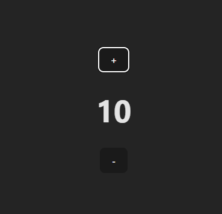

# Counting State

In this project, I created a counting app (Max. number is 10 and Min. number is 0) using state in react js

## Preview



## How To Run This Project

Clone this project url :

``` https://github.com/VsalCode/fgo24-react-basic.git ```

after entering the folder, install the dependencies:

```npm install```

To run the web you can use the command :

```npm run dev```

##  dependencies used
- Live Server


## How To Contribute

Pull requests are welcome. For major changes, please open an issue first
to discuss what you would like to change.

Please make sure to update tests as appropriate.

## License

[ISC](https://opensource.org/license/isc-license-txt)
